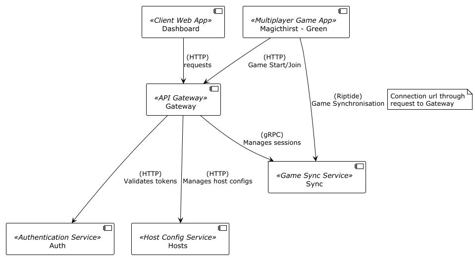

# Magicthirst

Изначально начавшийся как курсовой проект (на данный момент находится в процессе переписывания с Python на C#), в данной организации представлена многопользовательская игровая платформа, построенная на микросервисной архитектуре. Платформа предназначена для поддержки многопользователських игр с синхронизацией сессий в реальном времени.

Репозитории (компоненты) системы:
- [Dashboard](https://github.com/Magicthirst/host-dashboard) : Клиентское веб-приложение для создания и настройки аккаунта хоста.
- [Magicthirst - Green](https://github.com/Magicthirst/Magicthirst---Green) : Многопользовательское игровое приложение на Unity.
- [Gateway](https://github.com/Magicthirst/Service_Gateway_Py) : Единая точка входа для клиентских запросов. Занимается маршрутизацией запросов к остальным сервисам.
- [Sync](https://github.com/Magicthirst/Syncing-Battleship) : Микросервис занимающийся синхронизацией игровых сессий.
- [Auth](https://github.com/Magicthirst/Service_Auth_Py) : Управляет аутентификацией пользователей путём выдачи encrypted JWT (JWE) токенов.
- [Hosts](https://github.com/Magicthirst/Service_Hosts_Py) : Управляет конфигурациями аккаунтов хостов (правила доступа, списки блокировки и друзей).

Схема:

## Планы:

- Упаковать все сервисы в Docker-контейнеры для удобства использования
- Переписать сервисы на Auth и Hosts на C# для единообразия
- Добавить в сервисы Auth и Gateway лительно-живущие токены и кратко-живущие токены как и должно это работать
